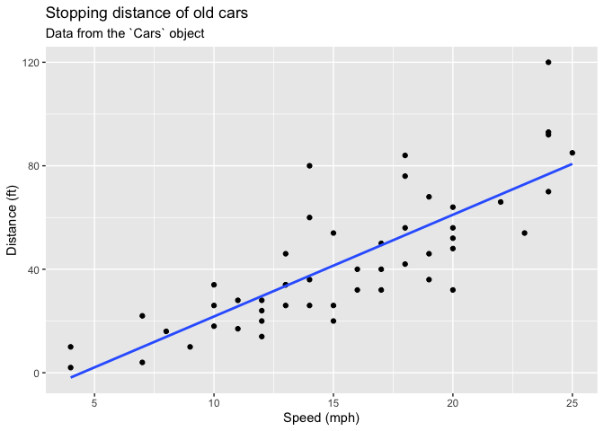
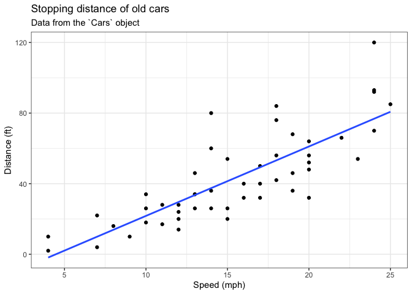
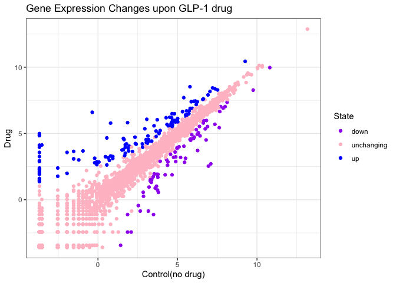
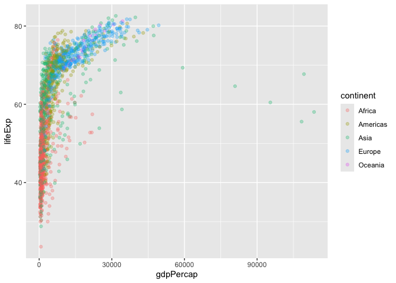
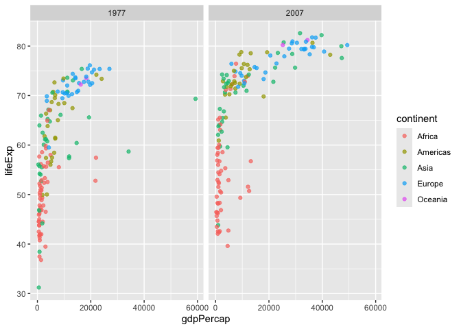

# Class 5: Data Viz with ggplot
Catherina Santoso (PID: A18552334)

## Background

There are lot’s of ways to make figures in R. These include so-called
“base R” graphics (e.g. `plot()`) and tones of add-on packages like
**ggplot2**.

For example here we make the same plot with both:

``` r
plot(cars)
```


First I need to install the package with the command
`install.packages()` \>**N.B.** We never run an install cmd in a quarto
code chunk or we will end up re-installing packages many many times -
which is not what we want!

``` r
library(ggplot2)
```

ggplot needs: - data - aesthetics - geom(etry)

``` r
ggplot(cars) +
  aes(x=speed,y=dist) +
  geom_point() 
```


add a line to better show relationship bw speed and dist

``` r
p <- ggplot(cars) +
  aes(x=speed,y=dist) +
  geom_point() +
  geom_smooth(method="lm", se=FALSE) +
  labs(title="Stopping distance of old cars",
       subtitle = "Data from the `Cars` object",
       x="Speed (mph)",
       y="Distance (ft)")

p
```

    `geom_smooth()` using formula = 'y ~ x'



``` r
p + theme_bw()
```

    `geom_smooth()` using formula = 'y ~ x'



``` r
url <- "https://bioboot.github.io/bimm143_S20/class-material/up_down_expression.txt"
genes <- read.delim(url)
head(genes)
```

            Gene Condition1 Condition2      State
    1      A4GNT -3.6808610 -3.4401355 unchanging
    2       AAAS  4.5479580  4.3864126 unchanging
    3      AASDH  3.7190695  3.4787276 unchanging
    4       AATF  5.0784720  5.0151916 unchanging
    5       AATK  0.4711421  0.5598642 unchanging
    6 AB015752.4 -3.6808610 -3.5921390 unchanging

``` r
ggplot(genes) +
  aes(Condition1, Condition2) +
  geom_point()
```


``` r
head(genes$State,3)
```

    [1] "unchanging" "unchanging" "unchanging"

Version 2 let’s color by `State` so we can see the up and down
significant genes compared to all the unchanging genes

``` r
ggplot(genes) +
  aes(Condition1, Condition2, col=State) +
  geom_point()
```


Vers 3 plot, modify default color to sth like this

``` r
ggplot(genes) +
  aes(Condition1, Condition2, col=State) +
  geom_point() +
  scale_color_manual(values=c("purple","pink","blue"))+
  labs(x="Control(no drug)",
       y="Drug",
       title = "Gene Expression Changes upon GLP-1 drug") +
  theme_bw()
```



## Going further

``` r
# File location online
url <- "https://raw.githubusercontent.com/jennybc/gapminder/master/inst/extdata/gapminder.tsv"

gapminder <- read.delim(url)
```

``` r
head(gapminder,3)
```

          country continent year lifeExp      pop gdpPercap
    1 Afghanistan      Asia 1952  28.801  8425333  779.4453
    2 Afghanistan      Asia 1957  30.332  9240934  820.8530
    3 Afghanistan      Asia 1962  31.997 10267083  853.1007

``` r
ggplot(gapminder)+
  aes(x=gdpPercap, y=lifeExp,col=continent)+
  geom_point(alpha=0.3)
```



Let’s “facet” (i.e. make a separate plot) by continent rather than the
big hot mess above.

``` r
ggplot(gapminder)+
  aes(x=gdpPercap, y=lifeExp,col=continent)+
  geom_point(alpha=0.3) +
  facet_wrap(~continent)
```


## Custom plots

How big is this gapminder dataset?

``` r
nrow(gapminder)
```

    [1] 1704

I want to “filter” down to a subset of this data. I will use the
**dplyr** package to help me. First I need to install it and then load
it up… `install.packages("dplyr")` and then `library(dplyr)`

``` r
library(dplyr)
```


    Attaching package: 'dplyr'

    The following objects are masked from 'package:stats':

        filter, lag

    The following objects are masked from 'package:base':

        intersect, setdiff, setequal, union

``` r
gapminder_2007 <- filter(gapminder,year==2007)
head(gapminder,3)
```

          country continent year lifeExp      pop gdpPercap
    1 Afghanistan      Asia 1952  28.801  8425333  779.4453
    2 Afghanistan      Asia 1957  30.332  9240934  820.8530
    3 Afghanistan      Asia 1962  31.997 10267083  853.1007

``` r
filter(gapminder_2007, year==2007, country == "Ireland")
```

      country continent year lifeExp     pop gdpPercap
    1 Ireland    Europe 2007  78.885 4109086     40676

> Q. Make a plot comparing 1977 and 2007 for all countries

``` r
input <- filter(gapminder, year %in% c(1977,2007))
head(input)
```

          country continent year lifeExp      pop gdpPercap
    1 Afghanistan      Asia 1977  38.438 14880372  786.1134
    2 Afghanistan      Asia 2007  43.828 31889923  974.5803
    3     Albania    Europe 1977  68.930  2509048 3533.0039
    4     Albania    Europe 2007  76.423  3600523 5937.0295
    5     Algeria    Africa 1977  58.014 17152804 4910.4168
    6     Algeria    Africa 2007  72.301 33333216 6223.3675

``` r
gapminder_1977 <- gapminder %>% filter(year==1977 | year==2007)

ggplot(gapminder_1977) + 
  geom_point(aes(x = gdpPercap, y = lifeExp, color=continent), alpha=0.7) + 
  scale_size_area(max_size = 10) +
  facet_wrap(~year)
```


